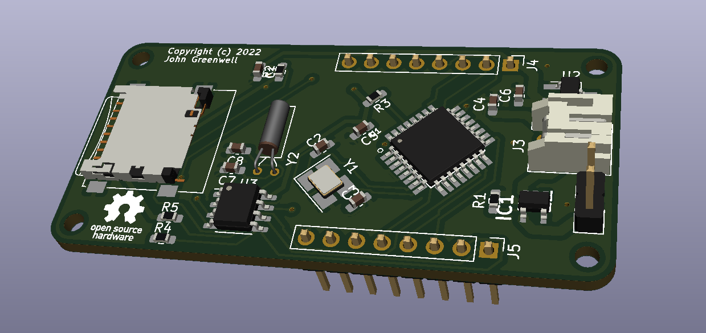
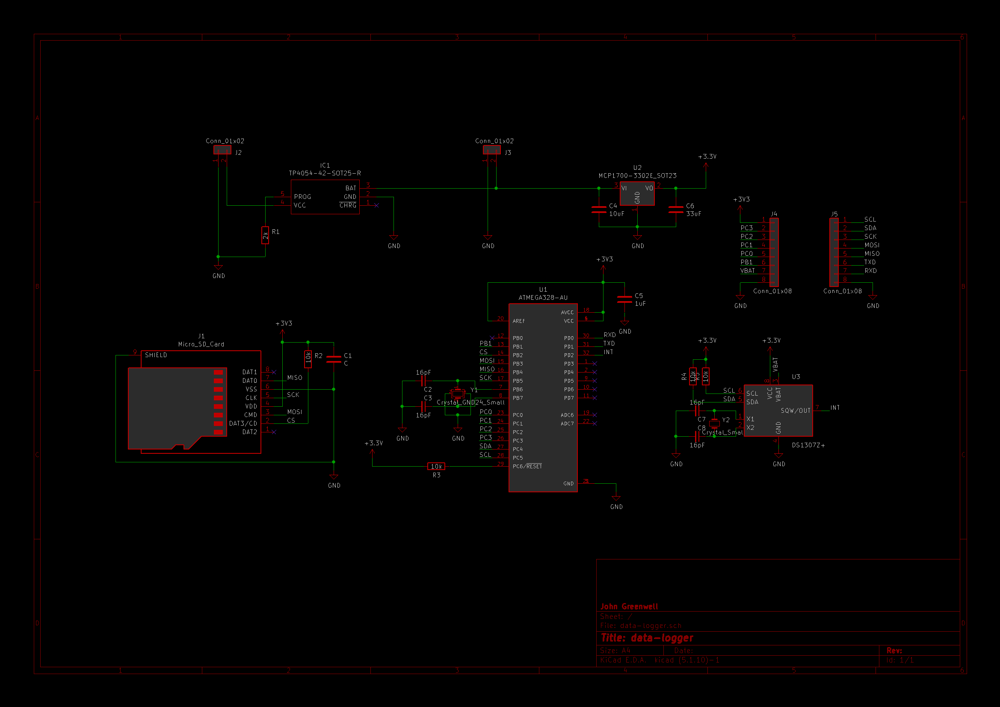

# Data Logger PCB Project

Custom PCB for Battery-Powered SD Card Data Logging

## Overview

This custom PCB incorporates an [Atmega328 microcontroller](https://www.digikey.com/en/products/detail/microchip-technology/ATMEGA328P-AU/1832260) interfaced with a [DS1037 RTC](https://www.digikey.com/en/products/detail/analog-devices-inc-maxim-integrated/DS1307Z/11523034) for time-keeping and a [MicroSD card slot](https://www.mouser.com/ProductDetail/Wurth-Elektronik/693072010801?qs=7gQLVZk5cPmw4uU1mAcUFg%3D%3D) for nonvolatile data write/read. The board may be powered with 3.3V externally or with a Li-Po battery able to be recharged on the board using adjacent 5V-GND pins and monitored by a [TP4054 linear charger IC](https://www.utsource.net/itm/p/5323872.html?digipart=1).



Pin header placement is designed to be breadboard-friendly. No components are soldered to the bottom of the board for space and simplicity consideration, as well as for opportunity to attach a coincell battery on the underside of the board for the RTC if desired. The board is designed in KiCad 5 with all source files available in the project [CAD directory](/cad).

## Usage

Interface with the SD card is accomplished by with the hardware SPI pins on the microcontroller, and similarly interface with the RTC is done with the hardware I2C pins. The SQW/OUT pin from the RTC is hard-wired to the INT0 pin on the microcontroller as input, allowing for events triggered on impulse from RTC signals, including wakeup from sleep modes for power-saving. Likewise, the VBAT pin on the RTC is available on an external pin so that a coincell battery may be attached to prevent time erasure on detachment of Li-Po or external battery.

Any suitable SPI SD library or I2C DS1307 RTC library may be used in the code for the microcontroller, provided the appropriate hardware protocols are utilized, as in the example code below.

```cpp
#include <TimeLib.h>
#include <DS1307RTC.h>
#include <SD.h>
...
tmElements_t tm;
File root;
...
const uint8_t INT0_PIN = 2;
const uint8_t CS_PIN = 10;
...
void setup(void) {
    bool parse=false;
    bool config=false;

    pinMode(INT0_PIN, INPUT);
    SPI.begin();
    Wire.begin();

    // Initialize RTC ref. DS1307RTC lib by Paul Stoffregen
    if (getDate(__DATE__) && getTime(__TIME__)) {
        parse = true;
        if (RTC.write(tm)) {
            config = true;
        }
  }

    // Initialize SD
    if (!SD.begin(CS_PIN)) {
        while (1);
    }
    root = SD.open("/");

}
...
```

## Schematic

The overall schematic for the test setup, along with its associated CAD files are included as composed in KiCad 5.



Improvements to this design could include silkscreen labels of pins for convenience, and possibly a re-orientation or expansion to the pin headers. Rather than VBAT as an external pin, footprint for a coincell battery holder might be added to the bottom of the board as optional. Additionally, the CHRG pin on the battery IC might be attached to an LED or tied back to the microcontroller for monitoring.

## License

MIT © 2022 John Greenwell